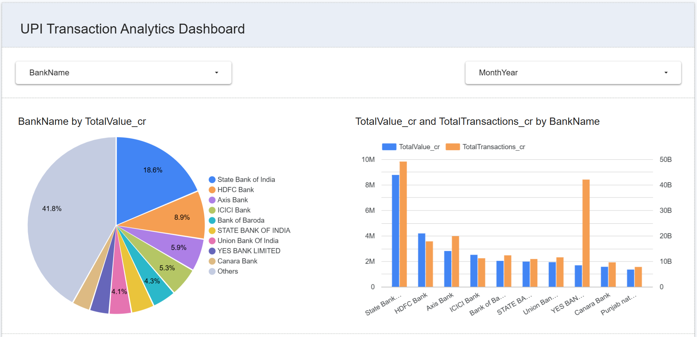

# UPI Transaction Analytics Pipeline
This project has been developed as part of final project for Data Engineering Zoomcamp 2025


## 📌 Problem Statement

India's Unified Payments Interface (UPI) processes **over 8 billion monthly transactions** (as of 2023), but analyzing this data poses challenges:
- **Data Fragmentation**: RBI releases reports across multiple formats (PDFs, Excel)
- **Manual Processing**: Lack of automated pipelines for trend analysis
- **Real-time Insights**: Difficulty tracking market share fluctuations

This project solves these by building an automated analytics pipeline for UPI transaction data.

## 🚀 Solution Highlights

### Automated ETL Pipeline
1. **Scrapes** RBI's official UPI statistics
2. **Cleans** and standardizes transaction data
3. **Loads** to BigQuery with optimized partitioning
4. **Visualizes** trends via Looker Studio

### Key Insights Generated
- Bank-wise market share trends
- Monthly growth patterns
- Remitter vs Beneficiary behavior
- Anomaly detection in transaction spikes

## 🌟 Why UPI Analytics Matters
UPI has revolutionized digital payments in India by:
- Processing **$1.7+ trillion** annually
- Enabling **300+ banks** on a single platform
- Growing at **50%+ YoY** since 2016

This analysis helps:
- **Banks** optimize infrastructure
- **Policymakers** identify adoption barriers
- **Businesses** understand payment trends

## 🛠️ Technology Stack

| Technology | Purpose | Key Feature Used |
|------------|---------|------------------|
| **Python** | Data processing | BeautifulSoup, Pandas |
| **Docker** | Containerization | Multi-service isolation |
| **GCP** | Cloud infrastructure | BigQuery, GCS, Dataflow |
| **Airflow** | Orchestration | Monthly DAG scheduling |
| **Looker Studio** | Visualization | UPI trend dashboards |
| **Terraform** | IaC | GCP resource provisioning |

## 📊 Dashboard Preview
[View Live Dashboard](https://lookerstudio.google.com/reporting/eaf357b8-94a0-40bc-8b22-7bb9ca4f3f8f) 



[Dataset Link](https://www.rbi.org.in/Scripts/EntityWiseRetailStatistics.aspx)

## 🚀 Getting Started

### Prerequisites
- GCP account with billing enabled
- Docker Desktop
- Python 3.9+

### Installation
```bash
git clone https://github.com/yourusername/upi-analytics.git
cd upi-analytics

# Setup environment
docker-compose build
docker-compose up -d airflow
```

### Running the Pipeline
```bash
# Manual run
./scripts/run_pipeline.sh

# Or trigger via Airflow UI
http://localhost:8080
```

## 📂 Repository Structure
```
upi-analytics/
├── airflow/           # DAG definitions
├── scripts/           # Python ETL scripts
├── config/            # GCP credentials
├── Dataset/              # Processed datasets
├── docker-compose.yml # Container orchestration
└── terraform/         # Infrastructure as Code
```

